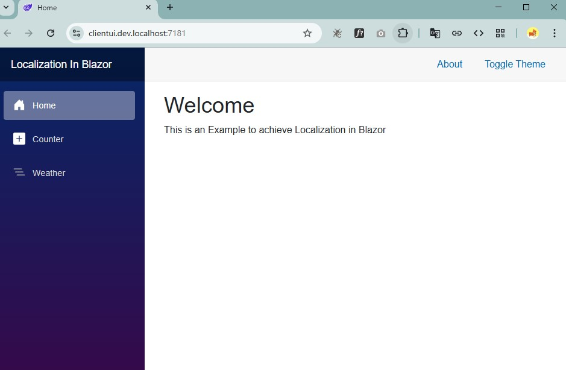
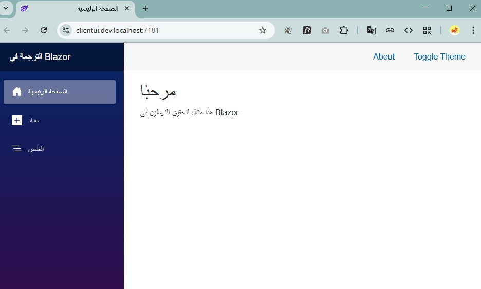

## Why This Repository?

Localization in Blazor is often shown in fragments.
This project provides a complete, working, and production-friendly setup for
English–Arabic localization in a Blazor Web App using .NET 10.


# Blazor Localization (English – Arabic)

A simple and practical example of implementing localization in a Blazor Web Application using .NET 10.

This project demonstrates:
- English (en-US) and Arabic (ar-SA) localization
- Resource-based localization using `.resx`
- Culture switching with cookies
- Proper calendar handling (Gregorian & Um Al-Qura)

---

## Tech Stack
- .NET 10
- Blazor Web App
- ASP.NET Core Localization
- JavaScript Interop

---

## Supported Languages
- English (en-US)
- Arabic (ar-SA)

---

## How It Works
- Localization is implemented using `IStringLocalizer`
- Shared resources are stored in `.resx` files
- Culture selection is persisted using `.AspNetCore.Culture` cookie
- UI reloads automatically after language change

---

## Preview

### English


### Arabic


---

## Running the Project
1. Clone the repository  
   ```bash
   git clone https://github.com/mafzal88/BlazorLocalization.git
 
2. Open the solution in Visual Studio 2026
3. Run the project
